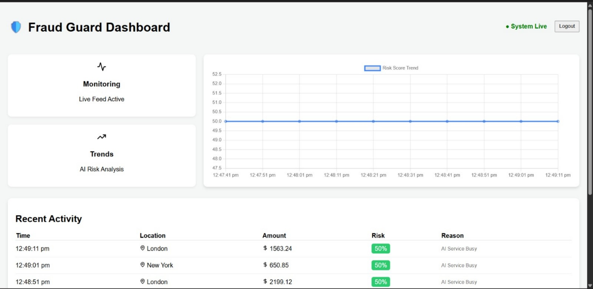
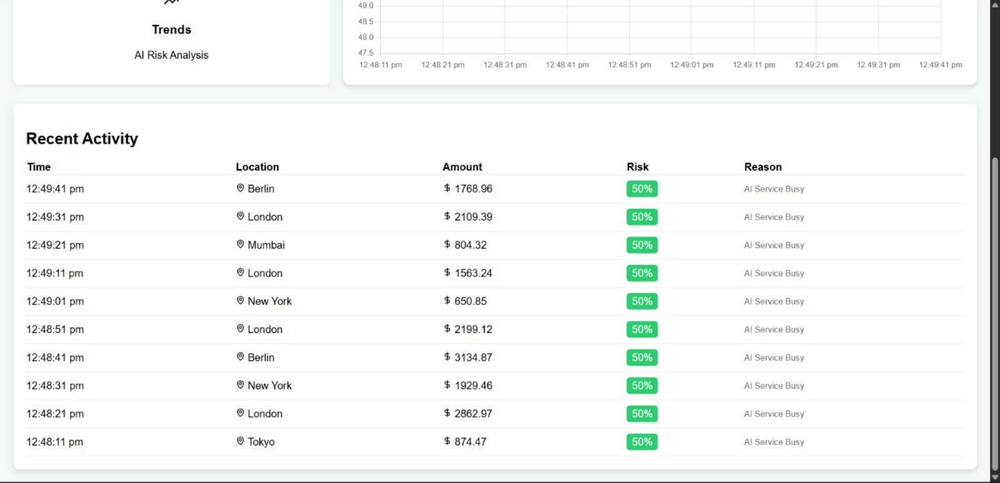

# 🛡️ Fraud Guard: Real-Time AI Fraud Detection Dashboard

**Fraud Guard** is a high-performance MERN stack application designed to monitor e-commerce transactions in real-time. By integrating **Google Gemini 1.5 Flash AI**, the system provides instant risk analysis and anomaly detection to prevent fraudulent activity before it occurs.

---

## 🌐 Live Deployment

Experience the application in production:

- **🚀 Live Dashboard:** [View on Vercel](https://real-time-fraud-detec-git-16ecfb-vishnumurthy441-2988s-projects.vercel.app/)
- **⚙️ Backend API:** [Check Render Status](https://real-time-fraud-detection-dashboard-aptl.onrender.com)

> **🔑 Manager Credentials:**
>
> - **Email:** `manager@store.com`
> - **Password:** `password123`

---

## 📺 Project Preview


_Real-time transaction monitoring with live status updates._


_Visualizing AI-generated risk scores using Redux and Chart.js._

---

## 🚀 Core Features

- **Real-Time Streaming:** Leveraging **Socket.io** for sub-second data updates.
- **AI Analysis:** Every transaction is analyzed by **Google Gemini AI** to provide a risk score and reasoning.
- **Global State Management:** Uses **Redux Toolkit** to synchronize live data across charts and tables.
- **Containerized:** Fully **Dockerized** using Docker Compose for consistent deployment.
- **Secure Access:** Enterprise-grade **JWT Authentication** for protected manager-level access.

---

## 🛠️ Tech Stack

- **Frontend:** React.js, Redux Toolkit, Chart.js, Lucide Icons.
- **Backend:** Node.js, Express.js, Socket.io, JWT.
- **Database:** MongoDB Atlas (Associate Developer Certified).
- **AI Engine:** Google Generative AI (Gemini 1.5 Flash).

---

## 📦 Installation & Setup

### Option 1: Using Docker (Recommended)

Ensure you have **Docker Desktop** running, then run:

```bash
docker-compose up --build
```
